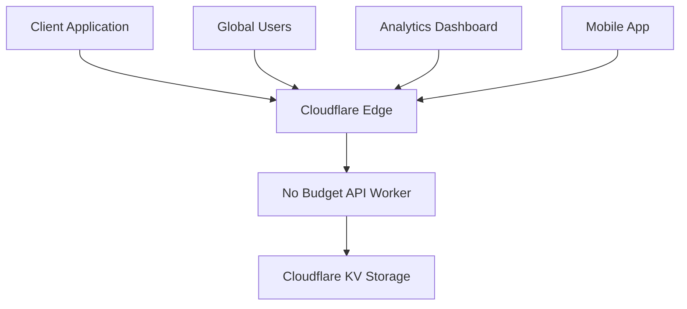

# Getting Started

Welcome to No Budget API! This guide will help you get up and running with your personal finance API in just a few minutes.

## What is No Budget API?

No Budget API is a comprehensive personal finance management system built as a REST API on Cloudflare Workers. It provides:

- Complete CRUD operations for financial transactions (bills)
- Rich statistics and analytics
- Flexible categorization and tagging
- Advanced filtering and search capabilities
- Global edge deployment for maximum performance

## Prerequisites

Before you begin, make sure you have:

- [Node.js](https://nodejs.org/) 18 or higher
- A [Cloudflare account](https://dash.cloudflare.com/sign-up) (free tier works great)
- Basic knowledge of REST APIs and HTTP requests

## Architecture Overview



The API is deployed as a Cloudflare Worker, which runs your code at edge locations around the world for optimal performance. Data is stored in Cloudflare KV, a globally distributed key-value store.

## Core Concepts

### Bills (Transactions)
The primary entity in the system. Each bill represents a financial transaction with:
- **UUID**: Unique identifier
- **Description**: Human-readable description
- **Type**: Either "receive" (income) or "pay" (expense)
- **Amount**: Monetary value (always positive)
- **Time**: ISO timestamp
- **Tag**: Custom organizational tag
- **Category**: Predefined category

### Statistics
The API provides comprehensive analytics:
- **Overview**: Current month vs all-time summaries
- **Monthly**: Month-by-month breakdowns
- **Category**: Spending analysis by category
- **Trend**: Time-based trend analysis

### Tags & Categories
Flexible organization system:
- **Tags**: Custom labels you create
- **Categories**: Predefined or custom categories
- Both can be used for filtering and analytics

## Data Flow

1. **Create**: POST new bills via API
2. **Store**: Data saved to Cloudflare KV
3. **Process**: Statistics calculated in real-time
4. **Retrieve**: GET bills with filtering options
5. **Analyze**: Rich analytics and reporting

## API Design Principles

- **RESTful**: Standard HTTP methods and status codes
- **Consistent**: Uniform response format across all endpoints
- **Documented**: Every endpoint thoroughly documented with examples
- **Validated**: Input validation with clear error messages
- **Paginated**: Large result sets properly paginated

## Response Format

All API responses follow this consistent structure:

```json
{
  "success": true,
  "data": {
    // Response data here
  },
  "timestamp": "2025-07-09T10:30:00.000Z"
}
```

Error responses:
```json
{
  "error": "Error type",
  "message": "Detailed error message",
  "timestamp": "2025-07-09T10:30:00.000Z"
}
```

## Next Steps

Now that you understand the basics, let's get the API installed and running:

1. [Installation](/guide/installation.html) - Set up the development environment
2. [Quick Start](/guide/quick-start.html) - Deploy your first instance
3. [Configuration](/guide/configuration.html) - Customize the setup

## Need Help?

- Check the [API Reference](/api/) for detailed endpoint documentation
- Browse [Examples](/examples/) for common use cases
- Visit our [GitHub repository](https://github.com/your-username/no-budget) for issues and discussions
